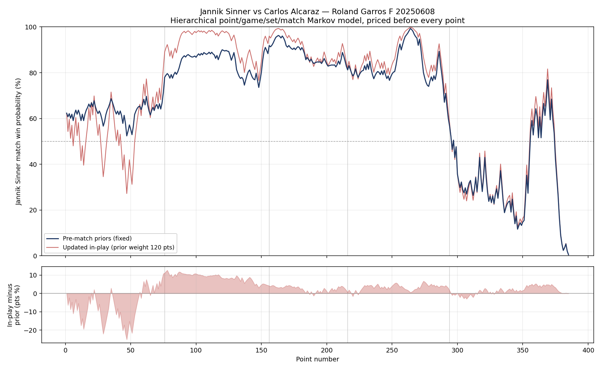

# Tennis In-Play Win Probability

A hierarchical Markov model that prices a tennis match from any in-play state,
backtested point by point against Jeff Sackmann's Match Charting Project data.

## The model

Tennis has the cleanest scoring structure in sport for this: match state is
fully observable, and the whole thing decomposes. Give me the probability each
player wins a point on serve and everything above it follows.

- **Point → game.** Closed-form deuce, standard advantage handling.
- **Game → set.** Recursion over game states with the server alternating.
- **Tiebreak.** Serve rotation modelled explicitly (one point, then pairs).
  Past 6-6 the win-by-two race collapses to a closed form; recursing through
  it is what blows the stack. Supports the 10-point deciding-set tiebreak.
- **Set → match.** Best of three or best of five.

Serve probability for a matchup uses the Klaassen-Magnus combination,
`p = server_spw − returner_rpw + (1 − tour_avg)`, so the returner's quality is
priced in rather than treating serve stats as context-free.

Validation: identical players return exactly 0.500 at point, game, tiebreak,
set and match level; best-of-five amplifies the favourite's edge over
best-of-three; 64.5% serve points won maps to an 81% hold, which is where
real ATP hard-court numbers sit.

## The backtest

`mcp_backtest.py` estimates each player's serve and return rates from their
other charted matches **on the same surface**, excluding the match being
replayed, then walks the match point by point and prices it before every
point.

Two variants run side by side:

- **Prior** — serve probabilities fixed at the pre-match estimate.
- **In-play** — probabilities updated after every point, shrinking the
  observed rate toward the prior with a 120-point pseudo-count.

The gap between the two lines is the point of the exercise. It's a crude
version of the question a trading desk answers all night: is what I'm watching
signal about this match, or noise around the number I started with?

## Worked example: Roland Garros 2025 final

Sinner vs Alcaraz. Priors from clay-court charted data:

| | Serve pts won | Return pts won | Sample |
|---|---|---|---|
| Sinner | 67.2% | 42.7% | ~4,700 / 5,000 pts |
| Alcaraz | 64.7% | 43.4% | ~5,400 / 5,800 pts |

Matchup serve probabilities: Sinner 0.609, Alcaraz 0.589. Near-even match,
slight edge Sinner.



**Peak: Sinner 99.32% at 2-1 sets, 5-3, 0-40 on the Alcaraz serve** — three
championship points, a fair price of 1.007. He lost the match. The curve from
that point to the deciding tiebreak is the whole argument for why an in-play
book needs traders and not just a model: the number was right, and the number
lost.

**Widest prior/in-play divergence: −25 percentage points, early in set one.**
The updating model had watched Sinner get broken and was already marking him
down hard; the prior model hadn't moved. Early in a match the update is mostly
noise, which is exactly why the pseudo-count exists and why choosing its size
is a judgement call rather than a fit.

## Running it

```
python mcp_backtest.py                        # RG 2025 final
python mcp_backtest.py --list "Alcaraz"       # find other match ids
python mcp_backtest.py --match-id <id>
```

Data downloads automatically from the Match Charting Project on first run.
No dependencies beyond matplotlib for the chart; the model itself is pure
standard library.

## Files

- `tennis_model.py` — the model. Point, game, tiebreak, set, match, plus
  devigging and EV helpers. No dependencies.
- `mcp_backtest.py` — data loader, prior estimation, point-by-point replay,
  chart.
- `win_prob_curve.csv` — every point priced, both variants, as decimal odds.

## Caveats

Points are assumed independent conditional on the server, the standard
Klaassen-Magnus assumption. It holds up well enough to be useful and breaks
in the places that matter most to a trader: fatigue, injury, momentum after a
break, and pressure on big points. Those are the gaps a person watching the
match fills in, and the model is built to be overridden rather than trusted
blindly.

Data credit: Jeff Sackmann's Match Charting Project (CC BY-NC-SA 4.0), a
crowd-sourced dataset. Charting coverage is uneven across players and events.
